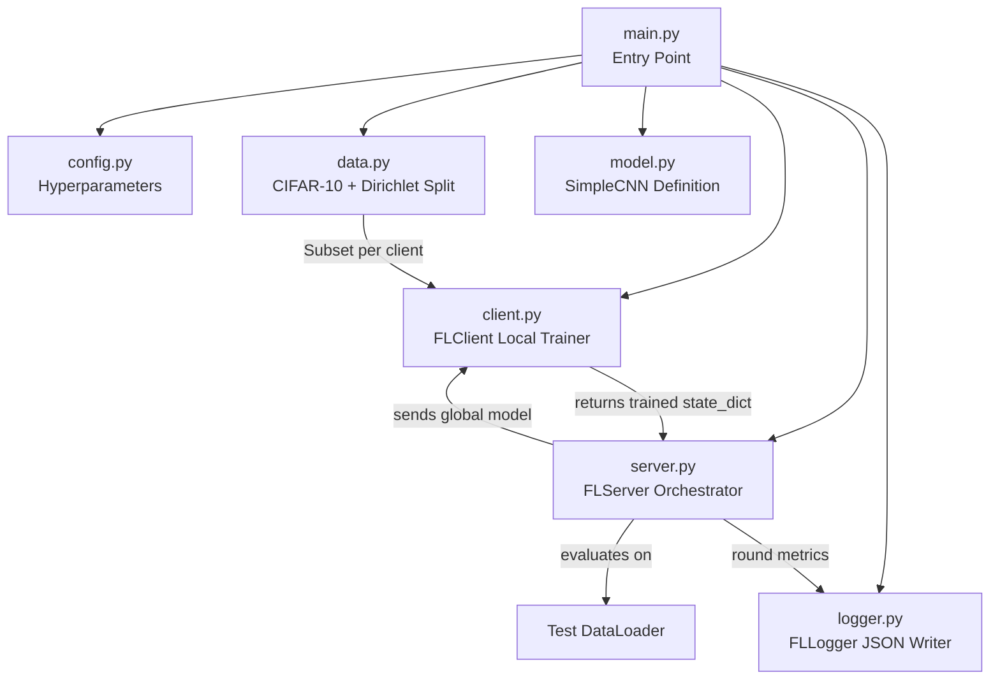
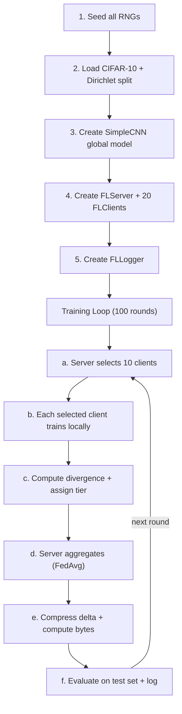
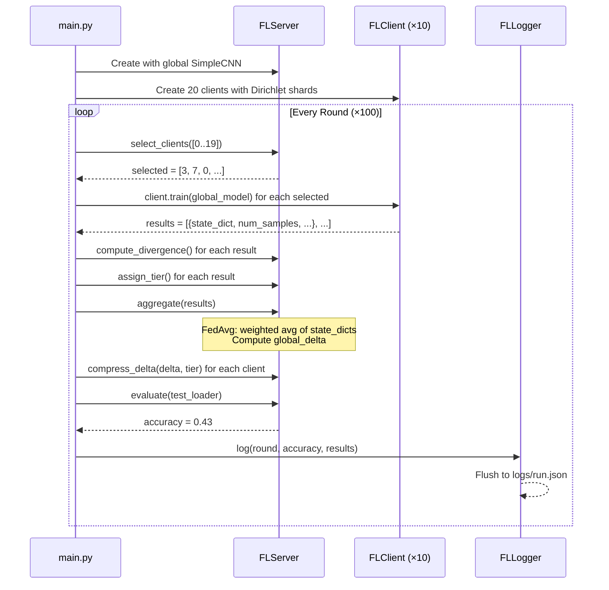

# DivRoute-FL — Complete Flow Walkthrough

## 1. Project Overview

**DivRoute-FL Lite** is a **Federated Averaging (FedAvg)** simulation built in PyTorch. It simulates a central server coordinating multiple clients, each holding a private shard of the CIFAR-10 dataset, to collaboratively train a shared CNN — **without any client ever sharing raw data**.

This codebase is a **baseline** (scaffolding). Several methods are intentionally left as stubs (divergence scoring, tiered compression, selection weight decay) to be implemented later by team members (Person B and Person C).

---

## 2. Architecture Diagram



---

## 3. Role of Each File

### 3.1 [`config.py`](file:///d:/GDG%20implementation/divroute_fl/config.py) — Single Source of Truth for Hyperparameters

A `@dataclass` that centralizes every tunable knob:

| Parameter | Default | Purpose |
|---|---|---|
| `num_clients` | 20 | Total number of simulated FL clients |
| `clients_per_round` | 10 | How many are sampled each round |
| `num_rounds` | 100 | Total communication rounds |
| `local_epochs` | 3 | SGD epochs per client per round |
| `local_lr` | 0.01 | Client-side learning rate |
| `batch_size` | 32 | Client-side mini-batch size |
| `alpha` | 0.5 | Dirichlet concentration (lower = more non-IID) |
| `tau_low` / `tau_high` | 0.70 / 0.90 | Cosine-similarity thresholds for tier assignment *(stub)* |
| `k_ratio_tier1` / `k_ratio_tier2` | 0.20 / 0.05 | Top-k compression ratios per tier *(stub)* |
| `gamma` | 0.85 | Selection weight decay for skipped clients *(stub)* |
| `seed` | 42 | Global random seed |
| `log_path` | `logs/run.json` | Output file for round-level metrics |

> [!NOTE]
> Parameters marked *(stub)* are defined here but not yet used in the baseline. They exist so Person B and Person C can implement divergence-aware routing and compression without modifying config.

---

### 3.2 [`data.py`](file:///d:/GDG%20implementation/divroute_fl/data.py) — Dataset Download & Non-IID Partitioning

**Two public functions:**

#### `get_client_datasets(num_clients, alpha, seed) → List[Subset]`

1. Downloads CIFAR-10 training set (50,000 images, 10 classes).
2. Applies normalization (mean/std from ImageNet-style CIFAR stats).
3. **Dirichlet-based partitioning** — the core logic:
   - For **each of the 10 classes**:
     - Find all indices belonging to that class (≈5,000 per class).
     - Draw a Dirichlet vector of length `num_clients` with concentration `alpha`.
     - This vector determines what **fraction** of that class each client gets.
     - Convert fractions → integer counts, distribute remainder round-robin.
     - Assign the corresponding image indices to each client's index list.
   - Result: each client gets a `Subset` of the training set with a **class-imbalanced** distribution.

**Why Dirichlet?**  
- `alpha = 0.5` → most of the probability mass concentrates on 1–2 clients per class → **highly non-IID**.
- `alpha = 100` → nearly uniform split → **IID**.

#### `get_test_dataset() → Dataset`

Returns the full CIFAR-10 test set (10,000 images) for global model evaluation.

---

### 3.3 [`model.py`](file:///d:/GDG%20implementation/divroute_fl/model.py) — SimpleCNN Architecture

A lightweight CNN (~200K parameters) for CIFAR-10:

```
Input: 3×32×32 image
  │
  ├─ Conv2d(3→32, 3×3, pad=1) → ReLU → MaxPool(2×2)    → 32×16×16
  ├─ Conv2d(32→64, 3×3, pad=1) → ReLU → MaxPool(2×2)   → 64×8×8
  ├─ Flatten                                              → 4096
  ├─ Linear(4096→512) → ReLU                             → 512
  └─ Linear(512→10)                                      → 10 (logits)
```

> [!TIP]
> The model is intentionally small so the entire FL simulation can run on a CPU in reasonable time.

---

### 3.4 [`client.py`](file:///d:/GDG%20implementation/divroute_fl/client.py) — FLClient (Local Trainer)

Each `FLClient` holds:
- A `client_id`
- A private `dataset` (a `Subset` of CIFAR-10)
- Training hyperparameters (`local_epochs`, `local_lr`, `batch_size`)

#### `train(global_model) → dict`

This is called once per round for each selected client. The logic:

1. **Deep-copy** the global model → `local_model` (so SGD doesn't mutate the server's weights).
2. Create a `DataLoader` over the client's private dataset.
3. Run `local_epochs` passes of **SGD with CrossEntropyLoss**:
   ```
   for each epoch:
       for each batch (images, labels):
           zero gradients
           forward pass → loss
           backward pass
           optimizer step
   ```
4. Cache the trained `local_model` internally (for later divergence computation).
5. Return a result dict:
   ```python
   {
       "client_id": 3,
       "state_dict": <deep copy of trained weights>,
       "num_samples": 2347,          # size of this client's dataset
       "divergence_score": None,     # placeholder
       "tier": None,                 # placeholder
       "bytes_received": None,       # placeholder
   }
   ```

#### `get_local_model() → nn.Module`

Returns the cached local model so the server can compute divergence between local and global models.

---

### 3.5 [`server.py`](file:///d:/GDG%20implementation/divroute_fl/server.py) — FLServer (Central Orchestrator)

The server manages the global model and coordinates all the FL operations:

#### `select_clients(all_ids) → List[int]`

- Weighted random sampling of `clients_per_round` clients (without replacement).
- Weights are **uniform** in the baseline (all clients equally likely).
- Uses a seeded RNG for reproducibility.

#### `aggregate(client_results) → None`

The **FedAvg algorithm**:

1. **Snapshot** the current global model as a flat 1-D vector (`old_flat`).
2. Compute `total_samples` across all selected clients.
3. **Weighted average** of client `state_dict`s:
   ```
   new_weight[key] = Σ (client_samples / total_samples) × client_weight[key]
   ```
   Clients with more data get proportionally more influence.
4. Load the new averaged weights into the global model.
5. Compute the **global delta**: `new_flat - old_flat` (how much the model changed this round).

#### `evaluate(test_loader) → float`

- Sets the global model to eval mode.
- Runs inference on the test set.
- Returns **top-1 accuracy** (correct / total).

#### Stub Methods (Placeholders)

| Method | Current Behavior | Future Purpose |
|---|---|---|
| `compute_divergence(local, global)` | Returns `1.0` always | Person B: cosine similarity between flattened local & global models |
| `assign_tier(divergence)` | Returns `1` always | Person B: map divergence to tier 1/2/3 using `tau_low`/`tau_high` |
| `compress_delta(delta, tier)` | Returns full delta (no compression) | Person C: top-k sparsification based on tier |

#### `_flatten(state_dict) → Tensor`

Helper that concatenates all parameter tensors into a single 1-D vector. Used for delta computation.

---

### 3.6 [`logger.py`](file:///d:/GDG%20implementation/divroute_fl/logger.py) — FLLogger (Metrics Persistence)

#### `log(round_idx, test_accuracy, client_results) → None`

Each round, it records:
```json
{
  "round": 0,
  "test_accuracy": 0.1523,
  "total_bytes_transmitted": 2456789,
  "clients": [
    {"client_id": 3, "divergence_score": 1.0, "tier": 1, "bytes_received": 245678},
    ...
  ]
}
```

And **flushes the entire history to disk** (`logs/run.json`) after every round — so if the experiment crashes, you don't lose data.

---

### 3.7 [`main.py`](file:///d:/GDG%20implementation/divroute_fl/main.py) — Entry Point & Training Loop

This is the **glue** that wires everything together. The `run()` function:



---

## 4. End-to-End Flow (Step by Step)

Here's exactly what happens when you run `python -m divroute_fl.main`:

### Phase 1: Initialization

1. **Seed everything** — `random`, `numpy`, `torch`, CUDA — all pinned to seed `42` for reproducibility.
2. **Device detection** — CUDA if available, else CPU.
3. **Data loading** — CIFAR-10 is downloaded (if needed) and split into 20 non-IID subsets via Dirichlet(α=0.5).
4. **Test set** — The full 10,000-image test set is wrapped in a `DataLoader(batch_size=256)`.
5. **Model** — A `SimpleCNN` is instantiated.
6. **Server** — `FLServer` wraps the global model, holds uniform selection weights, and seeds its own RNG.
7. **Clients** — 20 `FLClient` objects are created, each bound to its private `Subset`.
8. **Logger** — `FLLogger` creates the `logs/` directory and prepares to write `run.json`.

### Phase 2: Training Loop (repeated 100 times)

For each round `r` from 0 to 99:

| Step | What Happens | Code Location |
|---|---|---|
| **a. Select** | Server samples 10 client IDs (weighted random, currently uniform) | `server.select_clients()` |
| **b. Train** | Each selected client deep-copies the global model, trains on its private data for 3 epochs of SGD | `client.train()` |
| **c. Divergence** | Server computes divergence between each client's local model and the global model (stub: always 1.0) | `server.compute_divergence()` |
| **d. Tier** | Server assigns a tier based on divergence (stub: always tier 1) | `server.assign_tier()` |
| **e. Aggregate** | Server computes FedAvg: weighted average of client state_dicts by sample count → updates global model → computes global delta | `server.aggregate()` |
| **f. Compress** | Server "compresses" the global delta per client tier (stub: sends full delta, 4 bytes per param) | `server.compress_delta()` |
| **g. Evaluate** | Server runs the updated global model on the test set → top-1 accuracy | `server.evaluate()` |
| **h. Log** | Logger records round number, accuracy, bytes, per-client stats → flushes to JSON | `logger.log()` |

### Phase 3: Completion

After 100 rounds, the final log file path is printed.

---

## 5. Dry Run — Round 0

Let's trace through the **very first round** with concrete (illustrative) numbers.

### 5.1 Initialization State

```
Config: 20 clients, 10/round, 3 local epochs, lr=0.01, batch=32, α=0.5, seed=42
```

After Dirichlet partitioning (α=0.5), client dataset sizes might look like:

| Client | # Samples | Dominant Classes |
|---|---|---|
| 0 | 3,120 | airplane, ship |
| 1 | 1,845 | cat |
| 2 | 2,560 | automobile, truck |
| 3 | 2,347 | dog, deer |
| ... | ... | ... |
| 19 | 1,980 | frog, bird |

> [!NOTE]
> With α=0.5, datasets are very uneven in both size and class composition. Some clients may have mostly images from just 1–2 classes.

### 5.2 Step a — Client Selection

```python
server.select_clients([0, 1, 2, ..., 19])
```

- All weights are `1.0` → uniform probability `p = [0.05, 0.05, ..., 0.05]`
- Seeded RNG samples 10 IDs without replacement.
- **Result**: `selected = [3, 7, 0, 15, 11, 9, 18, 2, 6, 14]` (example)

### 5.3 Step b — Local Training

For each selected client (e.g., client 3 with 2,347 samples):

```
1. local_model = deep_copy(global_model)     # identical weights to server
2. DataLoader: 2347 samples / batch_size 32 = ~74 batches per epoch
3. For epoch 1, 2, 3:
     For each batch:
       images, labels → device
       logits = local_model(images)           # forward pass
       loss = CrossEntropyLoss(logits, labels) # compute loss
       loss.backward()                        # compute gradients
       optimizer.step()                       # SGD update: w ← w - 0.01 * grad
4. Cache local_model internally
5. Return:
   {
     "client_id": 3,
     "state_dict": {conv1.weight: ..., conv1.bias: ..., ...},
     "num_samples": 2347,
     "divergence_score": None,
     "tier": None,
     "bytes_received": None,
   }
```

This runs **independently** for all 10 selected clients. Each starts from the **same** global model but trains on **different private data** → their resulting weights **diverge**.

### 5.4 Step c — Divergence & Tier

For each of the 10 result dicts:

```python
r["divergence_score"] = server.compute_divergence(local_model, global_model)
# stub → always 1.0

r["tier"] = server.assign_tier(1.0)
# stub → always 1
```

### 5.5 Step d — FedAvg Aggregation

```python
server.aggregate(results)
```

**Walkthrough of aggregate():**

1. **Snapshot old global**:
   ```
   old_flat = flatten(global_model.state_dict())
   # e.g. a 1-D tensor of ~200,000 values (all model params concatenated)
   ```

2. **Compute total samples**:
   ```
   total_samples = 2347 + 3120 + 1845 + ... = ~25,000  (sum of 10 selected clients)
   ```

3. **Weighted average** — for every parameter key (e.g., `conv1.weight`):
   ```
   new["conv1.weight"] = 0.0
   for each client result r:
       weight = r.num_samples / total_samples   # e.g. 2347/25000 = 0.094
       new["conv1.weight"] += weight * r.state_dict["conv1.weight"]
   ```
   Clients with more data contribute more to the new global model.

4. **Load new weights** into `global_model`.

5. **Compute global delta**:
   ```
   new_flat = flatten(new_state)
   global_delta = new_flat - old_flat    # how much the model changed
   # ~200,000-element tensor
   ```

### 5.6 Step e — Compression (Stub)

For each of the 10 clients:

```python
payload = server.compress_delta(global_delta, tier=1)
# Returns:
# {
#     "tier": 1,
#     "values": global_delta.clone(),         # full delta, no compression
#     "indices": tensor([0, 1, 2, ..., 199999]),
#     "bytes_transmitted": 200000 * 4 = 800,000 bytes
# }

r["bytes_received"] = 800_000
```

> [!IMPORTANT]
> In the baseline, every client receives the **full model delta** (~800 KB). Person C will later implement top-k sparsification to send only 5–20% of the parameters, reducing bandwidth by 5–20×.

### 5.7 Step f — Evaluate & Log

```python
acc = server.evaluate(test_loader)
# Runs inference on 10,000 test images in batches of 256
# Round 0 accuracy: likely ~15-20% (barely above random for 10 classes)
```

```python
logger.log(round_idx=0, acc=0.1523, results=results)
```

Writes to `logs/run.json`:
```json
[
  {
    "round": 0,
    "test_accuracy": 0.1523,
    "total_bytes_transmitted": 8000000,
    "clients": [
      {"client_id": 3, "divergence_score": 1.0, "tier": 1, "bytes_received": 800000},
      {"client_id": 7, "divergence_score": 1.0, "tier": 1, "bytes_received": 800000},
      ...
    ]
  }
]
```

### 5.8 Console Output for Round 0

```
Round   1/100 | Accuracy: 0.1523 | Bytes:    8,000,000
```

### 5.9 Then Rounds 1–99 Repeat...

Each round:
- The global model gets progressively better as more clients contribute.
- Accuracy climbs from ~15% toward ~50–60% (CIFAR-10 with a small CNN and non-IID data).
- After round 100, the final JSON log is saved.

---

## 6. Data Flow Diagram



---

## 7. Key Design Decisions

| Decision | Rationale |
|---|---|
| **Dirichlet partitioning** | Industry-standard way to simulate non-IID federated data. α controls heterogeneity smoothly. |
| **Deep-copy for local training** | Prevents client SGD from mutating the server's global model weights in-memory. |
| **FedAvg (sample-weighted)** | The classic McMahan et al. (2017) baseline — simple, well-understood, easy to extend. |
| **Global delta as flat vector** | Makes downstream compression (top-k sparsification) trivial — just pick largest-magnitude indices. |
| **Stub methods** | The codebase is team-partitioned: Person A (this code) builds the simulation harness, Person B adds divergence-aware routing, Person C adds compression. Stubs define the interfaces. |
| **JSON logging per round** | Human-readable, easy to plot with pandas/matplotlib, flushed every round for crash safety. |
| **Seeded RNG everywhere** | Full reproducibility — same seed → same client selection, same Dirichlet split, same training trajectory. |

---

## 8. What's Not Yet Implemented (Stubs)

| Feature | Current Stub | Intended Behavior |
|---|---|---|
| **Divergence Scoring** | `compute_divergence() → 1.0` | Cosine similarity between flattened local & global models |
| **Tier Assignment** | `assign_tier() → 1` | `d < τ_low` → tier 1 (high fidelity), `τ_low ≤ d ≤ τ_high` → tier 2, `d > τ_high` → tier 3 (skip) |
| **Top-k Compression** | `compress_delta() → full delta` | Tier 1: send top 20% of delta params. Tier 2: send top 5%. Tier 3: skip entirely. |
| **Selection Weight Decay** | Uniform weights always | Skipped clients get their selection weight boosted by `γ` so they're prioritized next round |
