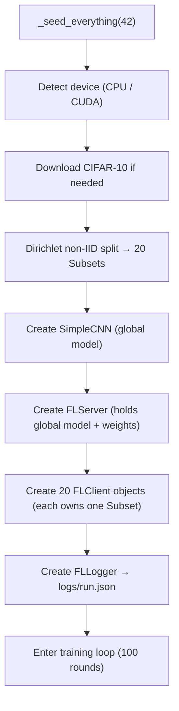
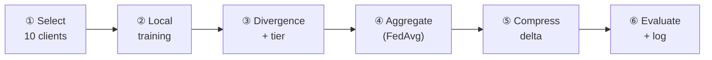

# DivRoute-FL Lite — Logical Flow & What to Watch

## 1. Startup / Initialization  (`main.py → run()`)



### What happens at each step

| Step | File | What it does |
|------|------|-------------|
| **Seed** | `main.py:15-22` | Pins `random`, `numpy`, `torch` RNGs so every run is identical |
| **Data split** | `data.py:19-51` | For each of the 10 CIFAR classes, draws a `Dirichlet(α=0.5)` vector of length 20 to decide what fraction of that class each client gets. Low α means some clients get 90% of one class and almost nothing of others — this is what makes divergence scores meaningful later |
| **Model** | `model.py` | `Conv(3→32)→ReLU→Pool→Conv(32→64)→ReLU→Pool→FC(4096→512)→FC(512→10)` — ~210k params |
| **Server** | `server.py:14-24` | Stores the global model, initialises uniform selection weights (all 1.0), creates its own RNG for client sampling |
| **Clients** | `client.py:8-18` | Each client stores a reference to its dataset shard, training hyperparams, and a slot for its last-trained local model |

---

## 2. Per-Round Training Loop

Every round follows these **6 stages**, executed sequentially:



---

### ① Client Selection — `server.select_clients()`
[server.py:26-35](file:///d:/GDG%20implementation/divroute_fl/server.py#L26-L35)

- Picks **10 out of 20** clients using weighted random sampling (without replacement).
- Weights start at 1.0 (uniform). After each round, clients that were **tier 3 (skipped)** have their weight multiplied by `γ = 0.85`, making them slightly less likely to be picked next time. Active clients get their weight reset to 1.0.
- This is the **selection-weight modulation** part of the research contribution.

---

### ② Local Training — `client.train(global_model)`
[client.py:20-46](file:///d:/GDG%20implementation/divroute_fl/client.py#L20-L46)

1. **Deep-copies** the server's global model (so training doesn't corrupt the shared copy).
2. Runs **3 epochs** of SGD (lr=0.01) on the client's private shard.
3. Caches the trained model internally (`self._local_model`) so the server can later compute divergence against it.
4. Returns a result dict:
   ```python
   {
       "client_id": 7,
       "state_dict": { ... },     # trained weights
       "num_samples": 2500,       # shard size (varies because of Dirichlet)
       "divergence_score": None,  # filled next
       "tier": None,              # filled next
       "bytes_received": None,    # filled in step ⑤
   }
   ```

> [!IMPORTANT]
> The deep-copy means each client trains **starting from the same global model** every round. The client does NOT accumulate progress across rounds — it always resets to the latest global model.

---

### ③ Divergence Score + Tier Assignment
[mechanism.py:7-20](file:///d:/GDG%20implementation/divroute_fl/mechanism.py#L7-L20)

For each client that just trained:

1. **`compute_divergence(local_model, global_model)`** — flattens both models into 1-D vectors and computes **cosine similarity** (0 = orthogonal, 1 = identical).
2. **`assign_tier(d, τ_low=0.70, τ_high=0.90)`**:

| Cosine Sim `d` | Tier | Meaning | What they receive |
|:-:|:-:|---|---|
| `d < 0.70` | **1** | Drifted far | High fidelity delta (top 20% of params) |
| `0.70 ≤ d < 0.90` | **2** | Mostly aligned | Low fidelity delta (top 5% of params) |
| `d ≥ 0.90` | **3** | Well converged | Nothing (skipped this round) |

> [!NOTE]
> Right now the cosine similarity is measured **after** local training, between the *locally-trained* model and the *pre-aggregation* global model. So it captures how much this client's SGD pushed the weights away from the global consensus.

---

### ④ FedAvg Aggregation — `server.aggregate(results)`
[server.py:37-51](file:///d:/GDG%20implementation/divroute_fl/server.py#L37-L51)

1. **Snapshots** the current global model as a flat vector (`old_flat`).
2. Computes a **weighted average** of all client state dicts, weighted by `num_samples` (clients with more data get more influence).
3. Loads the averaged weights into the global model.
4. Computes **`global_delta = new_flat − old_flat`** — this is the vector that Person C's compression operates on.

> [!TIP]
> The delta is a single 1-D tensor with ~210k elements (one per model parameter). Compression will select a subset of these to actually transmit.

---

### ⑤ Compress & Simulate Transmission — `server.compress_delta()`
[server.py:77-85](file:///d:/GDG%20implementation/divroute_fl/server.py#L77-L85)

Currently a **stub** — it returns the full delta with `bytes_transmitted = num_params × 4` (float32). When Person C replaces this:
- Tier 1 → top-k with k = 20% of params
- Tier 2 → top-k with k = 5% of params
- Tier 3 → 0 bytes (skipped)

---

### ⑥ Evaluate + Log
- [server.py:53-62](file:///d:/GDG%20implementation/divroute_fl/server.py#L53-L62) — runs the global model on the full CIFAR-10 test set (10k images), reports top-1 accuracy.
- [logger.py:12-31](file:///d:/GDG%20implementation/divroute_fl/logger.py#L12-L31) — appends a JSON entry for this round and flushes to `logs/run.json`.
- Console prints: `round X/100 | acc: 0.XXXX | bytes: N | tiers: T1/T2/T3`

---

## 3. Post-Round: Selection Weight Update
[mechanism.py:23-30](file:///d:/GDG%20implementation/divroute_fl/mechanism.py#L23-L30)

After logging, `update_selection_weights` adjusts the sampling probability for next round:
- **Tier 3 clients** → weight *= 0.85 (deprioritized)
- **Tier 1 / 2 clients** → weight = 1.0 (reset to full probability)

This prevents repeatedly skipping the same client forever while still biasing selection toward clients that need updates.

---

## 4. What to Watch While It Runs

### ✅ Healthy signs

| Metric | What to expect |
|---|---|
| **Accuracy** | Should climb from ~10% (random) to **55–65%** over 100 rounds. It won't be state-of-the-art — this is a tiny CNN with non-IID data |
| **Accuracy curve shape** | Fast initial gains (rounds 1–20), then slowing. If it's still climbing at round 100, it hasn't converged yet |
| **Shard sizes** | The `[init]` line prints min/max/mean. With α=0.5, expect **high variance** (e.g. min ~800, max ~5000, mean 2500). This is intentional |
| **Tier distribution** | Once mechanism.py is active: early rounds should be **mostly tier 1** (clients haven't converged). As training progresses, more clients should shift to tier 2 and eventually tier 3 |
| **Bytes per round** | With the stub: constant every round (~210k × 4 × 10 clients ≈ 8.4M). After Person C adds compression this should drop, especially as more clients hit tier 2/3 |

### 🚩 Red flags to watch for

| Symptom | Probable Cause |
|---|---|
| **Accuracy stuck at 10%** | Learning rate too high/low, or a bug in aggregation. Check that `new_state` is actually a weighted average, not just the last client's weights |
| **Accuracy oscillates wildly** | Too few clients per round (high variance in FedAvg). With 10/20 clients this should be mild. Could also mean lr is too high |
| **Accuracy suddenly drops** | A common FL artifact — one round sampled clients that were all heavily skewed to the same class, causing the global model to forget others. Should recover next round |
| **All divergence scores ≈ 1.0** | All clients land in tier 3 → everyone gets skipped → no learning. This means τ_high is too low, or clients aren't drifting (data might be accidentally IID) |
| **All divergence scores ≈ 0.0** | All clients land in tier 1 → no bandwidth savings. This means lr is too high or local_epochs too many — clients drift too far from global model each round |
| **`bytes_transmitted` = 0 for everyone** | All clients are tier 3 after compression is added. The model has converged, OR thresholds need tuning |
| **OOM / very slow** | On CPU with batch_size=32 and a 210k param model this should be fine. If slow, check you're not accidentally using a GPU without enough VRAM |
| **JSON log grows huge** | 100 rounds × 10 clients per round = 1000 client entries. The file should be ~200–500 KB — this is normal |

### 📊 Key numbers to note at the end of the run

1. **Final accuracy** (round 100) — your FedAvg baseline number
2. **Total bytes transmitted** (sum across all rounds) — the baseline communication cost
3. **Tier distribution over time** — should shift from tier-1-heavy → tier-2/3-heavy as model converges
4. **Per-client divergence variance** — confirms the non-IID split is actually causing heterogeneous drift

These numbers become the **baseline** that the full DivRoute-FL system (with real compression) will be compared against.
